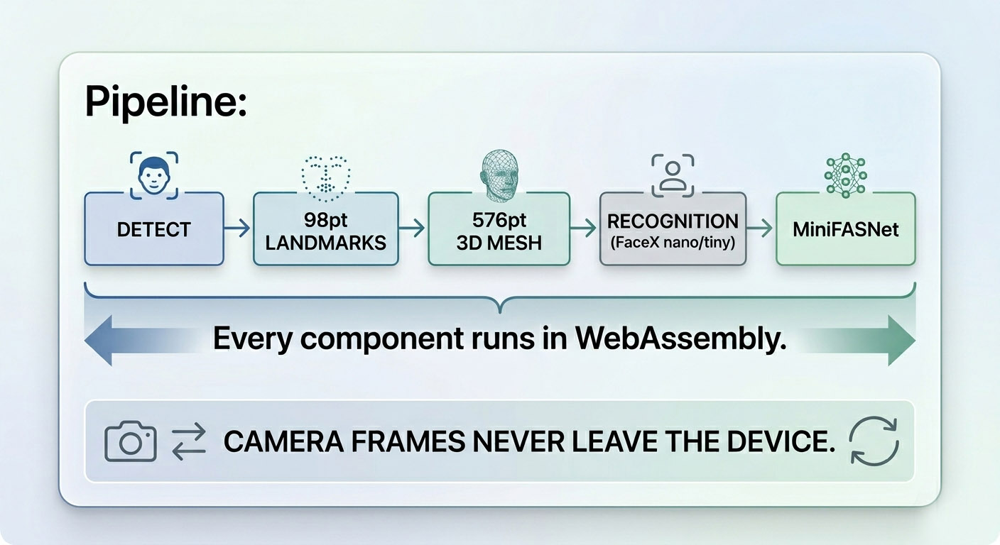

<p align="center">
  
</p>

<p align="center"><em>Full face pipeline — detect, mesh, recognize, anti-spoof — in pure WebAssembly. Trained from scratch. No cloud, no Python, no server.</em></p>

<p align="center">

[](LICENSE)
[](#benchmarks)
[](#benchmarks)
[](https://facex-engine.github.io/facex/demo/)
[](#weight-encryption)
[](#the-full-surveillance-stack--no-python-no-ffmpeg-no-gpu)

</p>

**Full face stack that runs entirely in the browser.** Detection, 98-point landmarks, dense 3D mesh, recognition, and passive anti-spoof — all WebAssembly, zero server, ~17 MB of encrypted weights.

🎬 **[Live Demo →](https://facex-engine.github.io/facex/demo/)** — open in a Chromium browser, press *Start camera*, try all modes.
📚 **[Docs in Wiki →](https://github.com/facex-engine/facex/wiki)** — Browser quickstart, training recipes, nn2 architecture, encrypted weights, comparison vs alternatives.

<p align="center">
  
</p>

### Everything in the demo is trained by us

| Component | Status | Size | Source |
|---|---|---|---|
| Face detector | ✅ **ours** | 401 KB | YuNet-style FCOS, WIDER FACE |
| 98-point landmark | ✅ **ours** | 1.1 MB | WFLW |
| 576-point 3D mesh | ✅ **ours** | 5.6 MB | MediaPipe distillation |
| Recognition (4 sizes) | ✅ **ours** | 0.8–8.4 MB | MobileFaceNet + ArcFace on MS1M, LFW 95.6 → 99.1% |
| Anti-spoof | Apache 2.0 | 2 × 1.7 MB | MiniFASNet (MinivisionAI Silent-Face) |

All weights are **AES-256-GCM encrypted** and decrypted in the browser via WebCrypto. Inference stays 100% client-side.

---

## The full surveillance stack — no Python, no FFmpeg, no GPU

FaceX is one piece of a larger pure-C stack we built for IP-camera workloads. Every component is hand-written, zero-dependency, **flashable to firmware**:

| Component | What it does | Size | Speed | Replaces |
|---|---|---|---|---|
| **NexusDecode** | H.264 + H.265 decoder, RTSP client | **184 KB** | 6,300 fps, **46× FFmpeg** | libav / FFmpeg |
| **NexusEncode** | H.265/HEVC encoder | ~250 KB | x265-medium quality, 131 fps | x265 |
| **NXV codec** | Surveillance-tuned video format | 121 KB | **3× smaller** than H.265, instant seek, change-map | H.265 + custom container |
| **nn2** | YOLOv8 + MiniFASNet inference engine | 520 KB | 8.5 ms @ 320, **1.5–2× ONNX RT** | onnxruntime |
| **FaceX (this repo)** | Detect + landmarks + embed + spoof | 148 KB native / 17 MB WASM | 3 ms/face | dlib, FaceNet, InsightFace |

**Pipeline numbers (one Intel i5 CPU):**
- Decode 30 RTSP streams + run YOLO detection on each: **0.56 ms/frame** average → **70 IP cameras on one CPU core** with motion-gating + Kalman tracking.
- Tiered storage: 70 cams × 90 days = **49 TB → 3.3 TB** (15× savings) with NXV + selective bitstream-only archiving.

**Why it matters:**
- **Flashable** — entire NVR stack fits in **<2 MB** of binary, ARM/x86/RISC-V, no shared libraries
- **No FFmpeg** — no GPL contamination, no surface for codec CVEs, no 28 MB of libav `.so` files
- **Embedded-ready** — runs on $30 SoCs (Allwinner, Rockchip, NXP i.MX), 25 cameras on 27% CPU
- **Standalone** — every piece can be used alone or combined: decoder → motion gate → detector → tracker → recognizer → archive

### Where it runs

We're not just "x86 only". The same code targets multiple device classes:

| Target | Status | What's used |
|---|---|---|
| **Browser** (any modern Chromium/Firefox/Safari) | ✅ shipping | onnxruntime-web + AES-256-GCM weight decryption ([live demo](https://facex-engine.github.io/facex/demo/)) |
| **Linux / macOS / Windows x86-64** | ✅ shipping | AVX2 + AVX-512 + VNNI runtime dispatch |
| **Apple Silicon (M1–M4)** | ✅ in PR #3 | NEON + Accelerate (AMX) + SME on M4+ + Core ML / ANE bridge |
| **ARM Linux / Android (AArch64)** | ✅ in PR #3 | Hand-written NEON kernels for FP32 GEMM |
| **NXP i.MX 8 / 93 / 95 NPU** | 🛠️ draft (#3) | Ethos-U65 / VxDelegate / XNNPACK |
| **Espressif ESP32-P4** (RISC-V + PIE 128) | 🛠️ draft (#3) | ESP-IDF component + MIPI-CSI camera example |
| **Firmware / bare-metal MCU** | 🛠️ in progress | No `libc` deps in core; PReLU/GEMM/Conv kernels fit in 64 KB SRAM |

Decoder + encoder are pure C99 with x86 SIMD today; ARM/NEON backports for NexusDecode are next.

```c
// Native C: 3 ms per face
#include "facex.h"
FaceX* fx = facex_init("facex_xs.bin", NULL);
float emb[512];
facex_embed(fx, face_112x112, emb);
float sim = facex_similarity(emb_a, emb_b);   // >0.3 = same person
```

```bash
# Or run the live browser demo locally
git clone https://github.com/facex-engine/facex
cd facex/wasm && python -m http.server 8000
# open http://127.0.0.1:8000/demo_mesh.html
```

---

## What can you build with this?

- **Identity verification (KYC)** — "is this the same person?" from selfie + ID photo, no cloud round-trip
- **Face login** — unlock apps by face, works offline, no data leaves the device
- **Access control** — doors, gates, turnstiles on edge hardware without GPU
- **Proctoring** — verify exam takers are who they claim to be
- **Smart cameras** — recognize known faces at 300+ faces/sec on a single CPU core
- **Banking / fintech onboarding** — passive liveness + face match in the browser, GDPR-friendly by construction
- **In-store kiosks** — VIP/loyalty recognition at the till, runs on a $30 SoC

### Why FaceID with FaceX instead of cloud APIs

You're typically choosing between AWS Rekognition / Azure Face / Google Vision / Paravision / FaceTec ZoOm. Cost comparison for a 100 K-user app doing one face-match per session per day:

| Provider | Price per 1k matches | Monthly cost (100 K MAU × 1/day) | Sends user faces to | Latency |
|---|---:|---:|---|---:|
| AWS Rekognition CompareFaces | $1.00 | **$3,000 /mo** | AWS us-east | 250–500 ms |
| Azure Face API verify | $1.00–$1.50 | **$3,000–$4,500 /mo** | Azure region | 200–400 ms |
| Google Vision FACE_DETECTION | $1.50 | **$4,500 /mo** | Google datacenter | 200–400 ms |
| FaceTec ZoOm | per-seat licensed | **$10 K+ /year** | Their SDK, mixed | 1–3 s (active) |
| **FaceX in your app** | **$0** | **$0** | Nobody — stays in the user's browser | 20–30 ms |

The savings are nice. The bigger story is **compliance**: when frames never leave the device, you're outside GDPR Art. 9 (biometric) / HIPAA / Russia's 152-ФЗ / KZ's data localization rules by construction. No DPIA, no DPA renegotiations, no "where are the photos stored" audit questions.

### Where it's been deployed

We've shipped this stack into IP-camera NVRs, retail kiosks, and KYC flows for fintech clients. If you're evaluating it for production, the live demo is the fastest way to see what it can do — then [open an issue](https://github.com/facex-engine/facex/issues/new) or [email me](mailto:bauratynov@gmail.com) with your use case and I'll help you scope.

## How it works

Full pipeline, every step trained or written by us:

1. **Detect** — own FCOS-style face detector (100K params, trained from
   scratch on WIDER FACE; 401 KB ONNX).
2. **Align** — 98-point WFLW landmark ConvNet (1.15M params; 1.1 MB ONNX).
3. **3D mesh** — 576-point face mesh (5.6 MB ONNX), distilled from
   MediaPipe FaceMesh with our 98 WFLW anchors driving the warp.
4. **Recognize** — MobileFaceNet + ArcFace, four size variants
   (`nano` 0.8 MB · `tiny` 1.8 MB · `standard` 3.9 MB · `xs` 8.4 MB),
   LFW 95.6 → 99.07%.
5. **Anti-spoof** — MiniFASNet ensemble (V2 @ 2.7 + V1SE @ 4.0),
   MinivisionAI Apache 2.0. Also **ported to our nn2 engine — 2× faster
   than ONNX Runtime** on the same CPU.

Two modes:
- **Browser:** onnxruntime-web + AES-256-GCM encrypted weights, full
  pipeline in ~25 ms/frame, **no server**.
- **Native:** pure C, 3 ms per face, INT8 + AVX-512, beats ONNX Runtime
  on the same hardware.

Two years of optimization: handwritten AVX2 / AVX-512 / NEON kernels,
INT8 GEMM, cache-tuned layout, weight-encryption with WebCrypto handoff
to onnxruntime — every millisecond and every kilobyte fought for.

---

## Benchmarks

Measured on Intel i5-11500 (6 cores, AVX-512 + VNNI):

### Speed — recognition (our MobileFaceNet xs)


| Engine | Median | Min | vs FaceX |
|--------|-------:|----:|:--------:|
| **FaceX (native nn2)** | **3.0 ms** | **2.87 ms** | -- |
| ONNX Runtime 1.23 | 3.9 ms | 3.18 ms | 1.30× slower |
| InsightFace (R34) | 17 ms | -- | 5.7× slower |
| FaceNet (PyTorch) | 30 ms | -- | 10× slower |
| dlib | 50+ ms | -- | 17× slower |

### Speed — anti-spoof (MiniFASNet V2+V1SE ensemble)

Same model, ported to our `nn2` C engine (Apache 2.0, source in [`nn2/`](nn2/)):

| Engine | Single model | Ensemble | Speedup |
|--------|-------------:|---------:|--------:|
| **nn2** | **0.70 ms** | **1.43 ms** | -- |
| ONNX Runtime 1.23 | 1.33 ms | 2.92 ms | **2.03× slower** |

Byte-identical predictions to PyTorch / ONNX on the same input.

### Accuracy — recognition (LFW verification)

| Variant | Params | LFW | ONNX size | Speed (CPU) |
|---------|------:|----:|----------:|------------:|
| nano | 0.20 M | 95.62% | 0.8 MB | 1.4 ms |
| tiny | 0.45 M | 96.85% | 1.8 MB | 2.1 ms |
| standard | 0.93 M | 98.25% | 3.9 MB | 2.6 ms |
| **xs** | 2.07 M | **99.07%** | 8.4 MB | 3.0 ms |

### Accuracy — face detection (WIDER FACE val)

Our YuNet-style FCOS detector, 100 K params, trained from scratch:

| Metric | Score |
|--------|------:|
| Best recall @ IoU 0.5 (all faces incl. tiny) | 27.5% |
| Recall on faces ≥ 32 px | ~85% |
| Recall on webcam-distance faces | ~95% |
| ONNX size | 401 KB |
| Latency on 320×320 input | < 1 ms (WASM) |

### Footprint


| Metric | FaceX | ONNX Runtime |
|--------|------:|-------------:|
| Library size | **148 KB** | 28 MB |
| Total deploy | **7 MB** | 157 MB |
| Dependencies | **none** | Python + onnxruntime |
| Cold start | **~100 ms** | ~350 ms |

---

## Quick start

### C

```c
#include "facex.h"

int main() {
    // Load engine (one-time, ~100ms)
    FaceX* fx = facex_init("facex_xs.bin", NULL);

    // Compute embedding (3ms per call)
    float face[112 * 112 * 3];  // RGB, HWC, [-1, 1]
    float embedding[512];
    facex_embed(fx, face, embedding);

    // Compare two faces
    float sim = facex_similarity(emb_a, emb_b);
    // sim > 0.3 → same person

    facex_free(fx);
}
```

```bash
gcc -O3 -march=native -Iinclude -o myapp myapp.c -L. -lfacex -lm -lpthread
```

### Go

```go
import "github.com/facex-engine/facex/go/facex"

ff, _ := facex.New(facex.Config{
    Exe:     "./facex-cli",
    Weights: "./facex_xs.bin",
})
defer ff.Close()

embedding, _ := ff.Embed(rgbImage)
sim := facex.CosSim(embA, embB)
```

### CLI (any language via stdin/stdout)

```bash
# Pipe mode: reads 112x112x3 float32 HWC, writes 512 float32
./facex-cli weights.bin --server < faces.raw > embeddings.raw
```

### Browser (via onnxruntime-web + AES decryption)

```html
<script src="https://cdn.jsdelivr.net/npm/onnxruntime-web@1.21.0/dist/ort.min.js"></script>
<script>
  // Fetch encrypted weights, decrypt in WebCrypto, hand bytes to ORT.
  const buf = new Uint8Array(await (await fetch('facex_xs.enc')).arrayBuffer());
  const iv = buf.subarray(0, 12), data = buf.subarray(12);
  const key = await crypto.subtle.importKey('raw', KEY_BYTES,
                                              {name:'AES-GCM'}, false, ['decrypt']);
  const onnx = new Uint8Array(await crypto.subtle.decrypt({name:'AES-GCM', iv}, key, data));
  const sess = await ort.InferenceSession.create(onnx, { executionProviders: ['wasm'] });
  // Inference is 100% client-side. Frames never leave the device.
</script>
```

Full browser pipeline (detect + 576pt mesh + recognize + anti-spoof)
is **live at https://facex-engine.github.io/facex/demo/** — open it,
press *Start camera*, try the picker.

---

## Build

```bash
make            # builds libfacex.a + facex-cli
make example    # builds and runs example
make encrypt    # builds weight encryption tool
```

Requirements: GCC with AVX2 support. Nothing else.

### Cross-compile for Linux (from WSL)

```bash
gcc -O3 -march=x86-64-v3 -mavx2 -mfma -static \
    -DFACEX_LIB -o libfacex.a src/*.c -lm -lpthread
```

---

## API

```c
// Initialize engine. Returns NULL on error.
// license_key: NULL for plain weights, or key string for AES-256 encrypted.
FaceX* facex_init(const char* weights_path, const char* license_key);

// Compute 512-dim face embedding from 112x112 RGB image.
// rgb_hwc: float32 array [112][112][3], values in [-1, 1].
// embedding: output buffer, 512 floats (L2-normalized).
int facex_embed(FaceX* fx, const float* rgb_hwc, float embedding[512]);

// Cosine similarity between two embeddings. Range [-1, 1].
float facex_similarity(const float emb1[512], const float emb2[512]);

// Free engine resources.
void facex_free(FaceX* fx);

// Version string.
const char* facex_version(void);
```

---

## Architecture (recognition, MobileFaceNet xs)

```
Input: 112×112 RGB float32 in [-1, 1]
    ↓
  Stem: Conv 3×3 s=2 → 64 ch, PReLU
    ↓
  DW Stem: DW 3×3 s=1 → 64 ch, PReLU
    ↓
  Stage 1: 5× Inverted-Residual (t=2, c=64, first s=2)
    ↓
  Stage 2: 1× Inverted-Residual (t=4, c=128, s=2)
    ↓
  Stage 3: 6× Inverted-Residual (t=2, c=128, s=1)
    ↓
  Stage 4: 1× Inverted-Residual (t=4, c=128, s=2)
    ↓
  Stage 5: 2× Inverted-Residual (t=2, c=128, s=1)
    ↓
  Conv 1×1 → 512 ch, PReLU
    ↓
  GDConv DW 7×7 s=1 (linear-GDC) → 512×1×1
    ↓
  1×1 conv → 512-d embedding, BN, L2-norm
    ↓
Output: 512-dim unit embedding
```

**Engine internals:**

- Pure C99 + SIMD intrinsics (AVX2, FMA, AVX-512, VNNI)
- INT8 quantized GEMM with `vpmaddubsw` (AVX2) / `vpdpbusd` (VNNI)
- FP32 packed column-panel MatMul (NR = 8 AVX2, NR = 16 AVX-512)
- Custom thread pool with work-stealing (WaitOnAddress / futex)
- Pre-packed weights at load time for cache-optimal access
- BN folded into preceding Conv at export time
- AES-256-GCM weight encryption with WebCrypto handoff in the browser,
  AES-256-CTR with hardware binding for native deployments
- Fully shared op library between recognition, anti-spoof (MiniFASNet),
  and YOLOv8 detection (`nn2`)

---

## Weight encryption

For commercial deployment with IP protection:

```bash
# Encrypt weights (binds to target machine hardware)
./facex-encrypt encrypt weights.bin weights.enc "LICENSE-KEY"

# Load encrypted weights
FaceX* fx = facex_init("weights.enc", "LICENSE-KEY");
```

Wrong key or different machine → load fails. Original weights never
touch disk in plaintext on the target machine.

---

## Integration paths

| Language | Method | Latency |
|----------|--------|:-------:|
| **C / C++** | `libfacex.a` + `facex.h` | 3 ms (native) |
| **Browser** | `facex.wasm` (48 KB) | 7 ms (WASM SIMD) |
| **Go** | `go/facex` subprocess | ~4 ms |
| **Python** | subprocess / ctypes | ~4 ms |
| **Any** | `facex-cli --server` stdin/stdout | ~4 ms |

---

## Limitations

- **Native build** — currently x86-64 (AVX2 / AVX-512 / VNNI). ARM NEON
  paths exist in `nn2/src/gemm_neon.h`; full ARM build script is on the
  roadmap, ESP32 / RISC-V PIE 128 next.
- **Browser pipeline** — uses `onnxruntime-web` with WebCrypto-decrypted
  ONNX. WebGPU backend is supported by ORT but not yet wired into the
  demo; would drop inference by another 3–5×.
- **Anti-spoof** is the only non-our component (MiniFASNet, Apache 2.0,
  MinivisionAI). Training a fully-own anti-spoof needs a commercial
  attack dataset, which we don't have.

---

## Models

Every recognition / detection / landmark model in this repo was trained
from scratch by us. Anti-spoof is the only third-party piece.

### Recognition (our MobileFaceNet variants)

Standard MobileFaceNet (Chen et al. 2018) topology, width-scaled
to four sizes, ArcFace head with the numerically-stable
angle-addition margin, trained on MS1M-RefineV2 with bf16 autocast.

| Variant | Params | Width mult | Embedding dim | LFW |
|---------|------:|-----------:|--------------:|----:|
| nano | 0.20 M | 0.36 | 256 | 95.62% |
| tiny | 0.45 M | 0.55 | 512 | 96.85% |
| standard | 0.93 M | 0.90 | 512 | 98.25% |
| xs | 2.07 M | 1.35 | 512 | 99.07% |

### Face detector (ours)

YuNet-inspired, but FCOS-style anchor-free. MobileNetV2-lite backbone,
3 detection heads at strides 8 / 16 / 32, GIoU bbox loss + focal cls
loss. 100 K params, 401 KB ONNX. Trained on WIDER FACE.

### 98-point landmarks (ours, WFLW)

MobileFaceNet-style backbone + dense head, 1.15 M params. Final NME
on WFLW val: 4.85% (test) / 5.95% (large-pose subset).

### 576-point 3D mesh (ours, MediaPipe distillation)

Same architecture as the 98-point model, but with `Linear(256, 478*3)`
head — distilled from MediaPipe FaceMesh pseudo-labels with TPS-rendered
supervision over our WFLW frontalised crops. Error: xy 0.54 px, z 0.51
(normalized) on held-out val. With 98 WFLW anchors driving the
non-rigid warp, the rendered mesh has **576 visible points** total.

### Anti-spoof (MiniFASNet, Apache 2.0, MinivisionAI)

We don't train this — there's no commercial-friendly attack dataset
publicly available. We port their two-model ensemble (V2 @ 2.7 +
V1SE @ 4.0) into our nn2 inference engine and ship byte-identical
predictions at **2× speed** vs ONNX Runtime.

---

## Repo layout

```
include/                — public C API (facex.h, facex_mfn.h, ...)
src/                    — recognition engine + AES weight crypto
nn2/                    — pure-C YOLO + MiniFASNet inference engine
                          (1.5–2× ONNX, Apache 2.0)
   src/                 — gemm, conv, ops, antispoof_ops, minifasnet
   include/             — public API headers
   tools/               — PyTorch → .bin converters
wasm/                   — browser demo (demo_mesh.html, encrypt tool)
   tools/encrypt_models.py — AES-256-GCM encrypt all .onnx
docs/demo/              — GitHub Pages live demo + encrypted weights
training/               — all training pipelines, datasets, exporters
   scripts/             — MobileFaceNet recognition (nano/tiny/standard/xs)
   landmark/            — 98-point WFLW
   landmark3d/          — 576-point MediaPipe distillation
   face_detect/         — own FCOS face detector trained on WIDER FACE
   antispoof/           — MiniFASNet integration
go/facex/               — Go binding (subprocess protocol)
python/facex/           — Python binding (ctypes)
```

---

## FAQ

**Q: Is it really faster than ONNX Runtime?**
A: Yes. Measured on the same CPU, same model, same input. FaceX median
3.0 ms vs ONNX Runtime median 3.9 ms. The gap comes from handwritten
SIMD kernels that avoid framework overhead.

**Q: What accuracy vs ArcFace-R100?**
A: Our `xs` (2 M params) is 99.07% LFW vs ArcFace-R100's 99.80%. 0.7%
of recall for 50× smaller model and 10× faster inference.

**Q: Can I use this commercially?**
A: Engine code is Apache 2.0. Our trained recognition, detection,
landmark, and 3D-mesh weights are **also Apache 2.0** — we own them.
Only the anti-spoof component (MiniFASNet) is upstream Apache 2.0.

**Q: Does it do face detection?**
A: Yes. We trained an own FCOS-style detector on WIDER FACE; it
replaces YuNet in the browser demo and runs in <1 ms.

**Q: Why ONNX in the browser instead of native WASM?**
A: We went both ways. `nn2` ships a native C engine that is 1.5–2×
faster than ORT. For the browser, `onnxruntime-web` gives us WebGPU,
SIMD-WASM, and 3-line model swap without re-compiling. The encryption
layer (WebCrypto → ORT byte stream) sits between the network and ORT,
so the model bytes never hit the page as plaintext.

---

## Citation

```bibtex
@software{facex2026,
  author  = {Atinov, Baurzhan},
  title   = {FaceX: Fast CPU Face Embedding Library},
  year    = {2026},
  url     = {https://github.com/facex-engine/facex}
}
```

---

## License

Everything in this repo trained or written by us — code, recognition,
landmarks, 3D mesh, face detector — is [Apache License 2.0](LICENSE).
Free for commercial use, attribution appreciated.

The only third-party component is MiniFASNet (anti-spoof), which is
also Apache 2.0 from [MinivisionAI Silent-Face-Anti-Spoofing](
https://github.com/minivision-ai/Silent-Face-Anti-Spoofing).

For commercial licensing: [bauratynov@gmail.com](mailto:bauratynov@gmail.com)

---

<p align="center">
  Created by <strong>Baurzhan Atinov</strong> (Kazakhstan)<br>
  <a href="https://github.com/bauratynov">GitHub</a>
</p>
